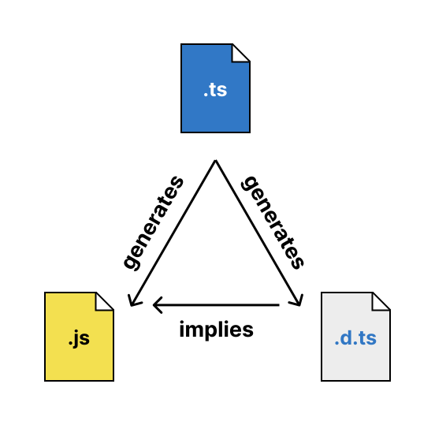

## JavaScript 中的脚本与模块

在 JavaScript 的早期，这门语言还只能运行在浏览器中，当时并没有模块的概念，但人们仍然可以通过在 HTML 中使用多个 `script` 标签，将一个网页的 JavaScript 代码拆分到多个文件中：

```html
<html>
  <head>
    <script src="a.js"></script>
    <script src="b.js"></script>
  </head>
  <body></body>
</html>
```

这种做法存在一些弊端，尤其随着网页规模越来越大、越来越复杂。特别是，加载到同一个页面上的所有脚本共享同一个作用域——顾名思义叫作“全局作用域”——这意味着各个脚本必须非常小心，以免互相覆盖彼此的变量和函数。

任何通过赋予每个文件独立作用域、同时仍提供将代码片段暴露给其他文件使用的方式来解决这一问题的系统，都可以称为“模块系统”（module system）。（在模块系统中将每个文件称为“模块”看似显而易见，但这个术语通常用来与在模块系统之外、在全局作用域中运行的 _脚本_（script）文件相对比。）

> 存在着[许多模块系统](https://github.com/myshov/history-of-javascript/tree/master/4_evolution_of_js_modularity)，TypeScript 也[支持生成其中的好几种](https://www.typescriptlang.org/tsconfig/#module)，但本文档将重点介绍当下最重要的两个系统：ECMAScript 模块（ESM）与 CommonJS（CJS）。
>
> ECMAScript 模块（ESM）是语言内置的模块系统，得到了现代浏览器以及 Node.js（从 v12 起）的原生支持。它使用专用的 `import` 和 `export` 语法：
>
> ```js
> // a.js
> export default 'Hello from a.js'
> ```
>
> ```js
> // b.js
> import a from './a.js'
> console.log(a) // 'Hello from a.js'
> ```
>
> CommonJS（CJS）是最初在 Node.js 中提供的模块系统，当时 ESM 尚未进入语言规范。目前 Node.js 中依然同时支持 CommonJS 与 ESM。它使用名为 `exports` 和 `require` 的普通 JavaScript 对象与函数：
>
> ```js
> // a.js
> exports.message = 'Hello from a.js'
> ```
>
> ```js
> // b.js
> const a = require('./a')
> console.log(a.message) // 'Hello from a.js'
> ```

因此，当 TypeScript 检测到一个文件是 CommonJS 或 ECMAScript 模块时，它首先会假定该文件具有自己的独立作用域。不过除此以外，编译器的任务就变得稍微复杂一些了。

## TypeScript 在模块方面的职责

TypeScript 编译器的主要目标是通过在编译时捕获某些运行时错误来预防它们。无论是否涉及模块，编译器都需要了解代码预期的运行时环境——例如有哪些全局变量可用。而当涉及模块时，编译器为了完成其工作，还需要回答若干额外的问题。让我们以几行输入代码为例，思考分析这段代码所需的全部信息：

```ts
import sayHello from 'greetings'
sayHello('world')
```

要检查此文件，编译器需要知道 `sayHello` 的类型（它是一个可以接受一个字符串参数的函数吗？），这引出了一系列额外的问题：

1. 模块系统是会直接加载此 TypeScript 文件，还是会加载由当前编译器（或其他编译器）从此 TypeScript 文件生成的 JavaScript 文件？
2. 鉴于模块系统将要加载的文件名及其在磁盘上的位置，模块系统期望找到哪种*类型*（kind）的模块？
3. 如果正在生成输出 JavaScript，那么此文件中存在的模块语法在输出代码中将如何转换？
4. 模块系统将去哪里查找由 `"greetings"` 指定的模块？查找能否成功？
5. 该查找所解析出的文件属于哪种类型的模块？
6. 模块系统是否允许在 (2) 中检测到的模块类型，通过在 (3) 中决定的语法去引用在 (5) 中检测到的模块类型？
7. 一旦分析了 `"greetings"` 模块，该模块的哪个部分会绑定到 `sayHello`？

请注意，所有这些问题都取决于*宿主*（host）的特征——宿主是指最终消费输出 JavaScript（或者在某些情况下消费原始 TypeScript）以主导其模块加载行为的系统，通常是运行时（如 Node.js）或打包器（如 Webpack）。

ECMAScript 规范定义了 ESM 的 import 和 export 如何相互连接，但它并未规定 (4) 中的文件查找（即*模块解析*，module resolution）具体如何发生，也未涉及像 CommonJS 这样的其他模块系统。因此，运行时和打包器（尤其是那些希望同时支持 ESM 和 CJS 的工具）拥有很大的自由度来设计自己的规则。相应地，TypeScript 回答上述问题的方式，会根据代码预期的运行环境而发生巨大变化。这里不存在唯一的标准答案，因此必须通过配置选项将规则告知编译器。

另一个需要牢记的核心观念是，TypeScript 几乎总是根据其*输出*的 JavaScript 文件来考量这些问题，而不是根据其*输入*的 TypeScript（或 JavaScript！）文件。如今，一些运行时和打包器支持直接加载 TypeScript 文件，在这些情况下，将输入文件和输出文件分开考虑并没有意义。本文档的大部分内容讨论的是将 TypeScript 文件编译为 JavaScript 文件、再由运行时模块系统加载这些 JavaScript 文件的场景。探讨这些场景对于理解编译器的选项和行为至关重要——从这里切入更容易理解，随后在思考 esbuild、Bun 以及其他[以 TypeScript 为先的运行时和打包器](#module-resolution-for-bundlers-typescript-runtimes-and-nodejs-loaders)时也能化繁为简。因此目前，我们可以从输出文件的角度来概括 TypeScript 在模块方面的职责：

充分理解**宿主的规则**，以便

1. 将文件编译为合法的**输出模块格式**，
2. 确保这些**输出**中的导入能够**成功解析**，并且
3. 知道应该为**导入的名称**赋予什么**类型**。

## 谁是宿主？

在继续之前，有必要确保大家对*宿主*（host）这一术语达成共识，因为它会频繁出现。我们之前将其定义为“最终消费输出代码以主导其模块加载行为的系统”。换句话说，它是 TypeScript 外部的系统，也是 TypeScript 的模块分析试图模拟的对象：

- 当输出代码（无论由 `tsc` 还是第三方转译器生成）直接在 Node.js 等运行时中运行时，该运行时就是宿主。
- 当不存在“输出代码”（因为运行时直接消费 TypeScript 文件）时，该运行时仍然是宿主。
- 当打包器消费 TypeScript 输入或输出并生成 bundle 时，该打包器就是宿主，因为它查看了原始的 imports/requires 集合，查找了它们引用的文件，并生成了一个新文件或一组文件，其中原始的 imports 和 requires 已被消除或转换得面目全非。（该 bundle 本身可能包含模块，运行它的运行时将是其宿主，但 TypeScript 对打包器之后发生的任何事情都一无所知。）
- 如果在 TypeScript 的输出上运行了另一个转译器、优化器或格式化工具，只要它不改动所看到的 imports 和 exports，它就*不是* TypeScript 所关心的宿主。
- 在 Web 浏览器中加载模块时，TypeScript 需要模拟的行为实际上分布在 Web 服务器与浏览器中运行的模块系统之间。浏览器的 JavaScript 引擎（或基于脚本的模块加载框架，如 RequireJS）控制接受哪些模块格式，而 Web 服务器则决定当一个模块触发加载另一个模块的请求时发送哪个文件。
- TypeScript 编译器本身并不是宿主，因为除了尝试模拟其他宿主之外，它不提供任何与模块相关的行为。

## 模块输出格式

在任何项目中，关于模块我们需要回答的第一个问题是宿主期望哪种类型的模块，以便 TypeScript 可以针对每个文件设置与其匹配的输出格式。有时，宿主仅*支持*一种模块——例如浏览器中的 ESM，或者 Node.js v11 及更早版本中的 CJS。Node.js v12 及更高版本同时接受 CJS 和 ES 模块，但使用文件扩展名以及 `package.json` 文件来确定每个文件应采用的格式，如果文件的内容与预期格式不符，则会抛出错误。

`module` 编译器选项向编译器提供此信息。其主要目的是控制编译期间生成的任何 JavaScript 的模块格式，但它也用于告知编译器应如何检测每个文件的模块类型、不同模块类型之间如何允许相互导入，以及是否可以使用 `import.meta` 和顶层 `await` 等特性。因此，即使 TypeScript 项目使用了 `noEmit`，为 `module` 选择正确的设置仍然至关重要。正如我们之前所确立的，编译器需要准确理解模块系统，以便能够对导入进行类型检查（并为其提供 IntelliSense）。有关为项目选择正确 `module` 设置的指导，请参阅[《选择编译器选项》](/docs/handbook/modules/guides/choosing-compiler-options.html)。

可用的 `module` 设置包括：

- [**`node16`**](/docs/handbook/modules/reference.html#node16-node18-node20-nodenext)：反映 Node.js v16+ 的模块系统，该系统在特定的互操作与检测规则下并存支持 ES 模块和 CJS 模块。
- [**`node18`**](/docs/handbook/modules/reference.html#node16-node18-node20-nodenext)：反映 Node.js v18+ 的模块系统，新增对导入属性（import attributes）的支持。
- [**`nodenext`**](/docs/handbook/modules/reference.html#node16-node18-node20-nodenext)：一个动态演进的目标，随着 Node.js 模块系统的发展反映最新的 Node.js 版本。从 TypeScript 5.8 开始，`nodenext` 支持通过 `require` 加载 ECMAScript 模块。
- [**`es2015`**](/docs/handbook/modules/reference.html#es2015-es2020-es2022-esnext)：反映 ES2015 语言规范中的 JavaScript 模块（该版本首次向语言引入了 `import` 和 `export`）。
- [**`es2020`**](/docs/handbook/modules/reference.html#es2015-es2020-es2022-esnext)：在 `es2015` 的基础上增加了对 `import.meta` 和 `export * as ns from "mod"` 的支持。
- [**`es2022`**](/docs/handbook/modules/reference.html#es2015-es2020-es2022-esnext)：在 `es2020` 的基础上增加了对顶层 `await` 的支持。
- [**`esnext`**](/docs/handbook/modules/reference.html#es2015-es2020-es2022-esnext)：目前与 `es2022` 相同，但它是一个动态演进的目标，反映最新的 ECMAScript 规范，以及预计将包含在即将发布的规范版本中的模块相关 Stage 3+ 提案。
- **[`commonjs`](/docs/handbook/modules/reference.html#commonjs)、[`system`](/docs/handbook/modules/reference.html#system)、[`amd`](/docs/handbook/modules/reference.html#amd) 和 [`umd`](/docs/handbook/modules/reference.html#umd)**：各自按其命名的模块系统输出所有内容，并假定所有内容都可以成功导入到该模块系统中。新项目不再推荐使用这些选项，本文档也不会对其进行详细展开。

> Node.js 针对模块格式检测和互操作性的规则，使得在运行于 Node.js 的项目中将 `module` 指定为 `esnext` 或 `commonjs` 是不正确的——即使 `tsc` 生成的所有文件分别全部是 ESM 或 CJS。对于打算在 Node.js 中运行的项目，唯一正确的 `module` 设置是 `node16` 和 `nodenext`。虽然对于纯 ESM 的 Node.js 项目，使用 `esnext` 和 `nodenext` 编译生成的 JavaScript 看起来可能完全相同，但类型检查却可能存在差异。有关更多详细信息，请参阅 [关于 `nodenext` 的参考章节](/docs/handbook/modules/reference.html#node16-node18-node20-nodenext)。

### 模块格式检测

Node.js 同时支持 ES 模块和 CJS 模块，但每个文件的格式取决于其文件扩展名，以及从该文件所在目录向所有父级目录查找时找到的第一个 `package.json` 文件中的 `type` 字段：

- `.mjs` 和 `.cjs` 文件始终分别被解释为 ES 模块和 CJS 模块。
- 如果最近的 `package.json` 文件包含值为 `"module"` 的 `type` 字段，则 `.js` 文件被解释为 ES 模块。如果不存在 `package.json` 文件，或者 `type` 字段缺失或为任何其他值，则 `.js` 文件被解释为 CJS 模块。

如果根据这些规则判定某个文件为 ES 模块，Node.js 在求值期间将不会向该文件的作用域中注入 CommonJS 的 `module` 和 `require` 对象，因此尝试使用它们的文件将导致崩溃。反之，如果判定某个文件为 CJS 模块，则该文件中的 `import` 和 `export` 声明将导致语法错误并崩溃。

当 `module` 编译器选项设置为 `node16`、`node18` 或 `nodenext` 时，TypeScript 会将相同的算法应用于项目的*输入*文件，以确定每个对应*输出*文件的模块类型。让我们看看在使用 `--module nodenext` 的示例项目中如何检测模块格式：

| 输入文件名                       | 内容                   | 输出文件名    | 模块类型 | 原因                                     |
| -------------------------------- | ---------------------- | ------------- | -------- | ---------------------------------------- |
| `/package.json`                  | `{}`                   |               |          |                                          |
| `/main.mts`                      |                        | `/main.mjs`   | ESM      | 文件扩展名                               |
| `/utils.cts`                     |                        | `/utils.cjs`  | CJS      | 文件扩展名                               |
| `/example.ts`                    |                        | `/example.js` | CJS      | `package.json` 中没有 `"type": "module"` |
| `/node_modules/pkg/package.json` | `{ "type": "module" }` |               |          |                                          |
| `/node_modules/pkg/index.d.ts`   |                        |               | ESM      | `package.json` 中包含 `"type": "module"` |
| `/node_modules/pkg/index.d.cts`  |                        |               | CJS      | 文件扩展名                               |

当输入文件扩展名为 `.mts` 或 `.cts` 时，TypeScript 知道分别将该文件视为 ES 模块或 CJS 模块，因为 Node.js 会将输出的 `.mjs` 文件视为 ES 模块，将输出的 `.cjs` 文件视为 CJS 模块。当输入文件扩展名为 `.ts` 时，TypeScript 必须查阅最近的 `package.json` 文件来确定模块格式，因为这正是 Node.js 遇到输出的 `.js` 文件时所做的事情。（请注意，相同的规则也适用于 `pkg` 依赖项中的 `.d.cts` 和 `.d.ts` 声明文件：尽管作为本次编译的一部分它们不会产生输出文件，但 `.d.ts` 文件的存在*意味着*存在相应的 `.js` 文件——可能是 `pkg` 库的作者在自己的输入 `.ts` 文件上运行 `tsc` 时创建的——由于其 `.js` 扩展名以及 `/node_modules/pkg/package.json` 中存在 `"type": "module"` 字段，Node.js 必须将其解释为 ES 模块。声明文件将在[后续小节](#the-role-of-declaration-files)中更详细地介绍。）

TypeScript 利用检测到的输入文件模块格式，来确保在每个输出文件中生成 Node.js 所期望的输出语法。如果 TypeScript 生成包含 `import` 和 `export` 语句的 `/example.js`，Node.js 在解析该文件时就会崩溃。如果 TypeScript 生成包含 `require` 调用的 `/main.mjs`，Node.js 在求值期间就会崩溃。除代码生成外，模块格式还用于确定类型检查和模块解析的规则，我们将在接下来的小节中对此进行讨论。

从 TypeScript 5.6 开始，其他 `--module` 模式（如 `esnext` 和 `commonjs`）也支持将特定格式的文件扩展名（`.mts` 和 `.cts`）作为生成格式的文件级覆盖选项。例如，即使 `--module` 设置为 `commonjs`，名为 `main.mts` 的文件也会在 `main.mjs` 中生成 ESM 语法。

值得再次提及的是，TypeScript 在 `--module node16`、`--module node18` 和 `--module nodenext` 下的行为完全是由 Node.js 的行为所驱动的。因为 TypeScript 的目标是在编译时捕获潜在的运行时错误，所以它需要对运行时发生的情况建立极其精确的模型。这套相当复杂的模块类型检测规则对于检查将在 Node.js 中运行的代码是*必需的*，但如果应用于非 Node.js 宿主，则可能过于严格甚至不正确。

### 输入模块语法

需要特别注意的是，在输入源文件中看到的*输入*模块语法，与输出到 JS 文件中的输出模块语法在一定程度上是解耦的。也就是说，一个包含 ESM 导入的文件：

```ts
import { sayHello } from 'greetings'
sayHello('world')
```

可能会完全按原样以 ESM 格式输出，也可能会输出为 CommonJS：

```ts
Object.defineProperty(exports, '__esModule', { value: true })
const greetings_1 = require('greetings')
;(0, greetings_1.sayHello)('world')
```

这取决于 `module` 编译器选项（以及任何适用的[模块格式检测](#module-format-detection)规则，前提是该 `module` 选项支持多种模块类型）。一般来说，这意味着仅凭输入文件的内容不足以确定它究竟是 ES 模块还是 CJS 模块。

> 如今，无论输出格式如何，大多数 TypeScript 文件都是使用 ESM 语法（`import` 和 `export` 语句）编写的。这在很大程度上是 ESM 走向广泛支持的漫长历程所留下的历史产物。ECMAScript 模块于 2015 年标准化，2017 年在大多数浏览器中得到支持，并在 2019 年落户 Node.js v12。在此期间的大部分时间里，人们清楚地认识到 ESM 是 JavaScript 模块的未来，但极少有运行时能够直接消费它。Babel 等工具使得用 ESM 编写 JavaScript 并降级为可在 Node.js 或浏览器中使用的其他模块格式成为可能。TypeScript 也紧随其后，在 [1.5 版本发布](https://devblogs.microsoft.com/typescript/announcing-typescript-1-5/) 中增加了对 ES 模块语法的支持，并委婉地劝阻使用最初受 CommonJS 启发的 `import fs = require("fs")` 语法。
>
> 这种“编写 ESM，输出任意格式”策略的优势在于 TypeScript 可以使用标准 JavaScript 语法，让新手的编写体验感到熟悉，并且（理论上）使项目在未来转向以 ESM 为输出目标变得更加容易。然而它也带来了三个显著的劣势，这些劣势在 ESM 和 CJS 模块被允许在 Node.js 中共存和互操作之后才完全显现出来：
>
> 1. 最初关于 ESM/CJS 互操作在 Node.js 中如何工作的假设被证明是错误的，如今 Node.js 与打包器之间的互操作规则各不相同。因此，TypeScript 中的模块配置选项空间非常庞大。
> 2. 当输入文件中的语法看起来全都像 ESM 时，编写者或代码审查者很容易忽略某个文件在运行时究竟是哪种模块。而由于 Node.js 的互操作规则，每个文件究竟属于哪种模块变得至关重要。
> 3. 当输入文件用 ESM 编写时，类型声明输出（`.d.ts` 文件）中的语法看起来也像 ESM。但由于对应的 JavaScript 文件可能以任何模块格式输出，TypeScript 无法仅通过查看类型声明的内容来判断文件属于哪种模块。同样地，由于 ESM/CJS 互操作的本质，TypeScript *必须*清楚每个事物属于哪种模块，才能提供正确的类型并阻止会导致崩溃的导入。
>
> 在 TypeScript 5.0 中，引入了一个名为 `verbatimModuleSyntax` 的新编译器选项，以帮助 TypeScript 编写者明确知道其 `import` 和 `export` 语句将如何被输出。启用后，该标志要求输入文件中的导入和导出必须采用在输出前经历最少转换的形式编写。因此，如果一个文件将作为 ESM 输出，则导入和导出必须使用 ESM 语法编写；如果一个文件将作为 CJS 输出，则必须使用受 CommonJS 启发的 TypeScript 语法编写（`import fs = require("fs")` 和 `export = {}`）。该设置特别推荐用于主要使用 ESM 但有少数 CJS 文件的 Node.js 项目。不推荐用于当前以 CJS 为目标但将来可能希望以 ESM 为目标的项目。

### ESM 与 CJS 互操作性

ES 模块能否 `import` 一个 CommonJS 模块？如果可以，默认导入是绑定到 `exports` 还是 `exports.default`？CommonJS 模块能否 `require` 一个 ES 模块？CommonJS 并不是 ECMAScript 规范的一部分，因此自 2015 年 ESM 标准化以来，运行时、打包器和转译器都可以自由给出自己的答案，因此并不存在一套标准的互操作规则。如今，大多数运行时和打包器大致可以归入以下三类之一：

1. **仅限 ESM（ESM-only）。** 某些运行时（如浏览器引擎）仅支持语言真正包含的部分：ECMAScript 模块。
2. **类似打包器（Bundler-like）。** 在任何主流 JavaScript 引擎能够运行 ES 模块之前，Babel 就允许开发者通过将它们转译为 CommonJS 来编写代码。这些“ESM 转译为 CJS”的文件与手写 CJS 文件之间的交互方式，催生了一套宽松的互操作规则，并已成为打包器和转译器事实上的标准。
3. **Node.js。** 在 Node.js v20.19.0 之前，CommonJS 模块无法同步加载 ES 模块（使用 `require`）；它们只能通过动态 `import()` 调用异步加载它们。ES 模块可以默认导入 CJS 模块，该导入始终绑定到 `exports`。（这意味着对带有 `__esModule` 的类似 Babel 的 CJS 输出进行默认导入时，Node.js 与某些打包器之间的表现会有所不同。）

TypeScript 需要知道假定采用哪套规则集，以便在导入（尤其是 `default` 导入）上提供正确的类型，并在运行时会发生崩溃的导入上报错。当 `module` 编译器选项设置为 `node16`、`node18` 或 `nodenext` 时，将强制执行 Node.js 特定版本的规则。[^1] 所有其他 `module` 设置在结合 [`esModuleInterop`](/docs/handbook/modules/reference.html#esModuleInterop) 选项时，在 TypeScript 中都会产生类似打包器的互操作行为。（虽然使用 `--module esnext` 会阻止你*编写* CommonJS 模块，但它不会阻止你将其作为依赖项*导入*。目前尚无任何 TypeScript 设置能够防范 ES 模块导入 CommonJS 模块，而对于直接在浏览器中运行的代码而言本应具备这种防范。）

[^1]: 在 Node.js v20.19.0 及更高版本中，允许对 ES 模块执行 `require`，但前提是解析出的模块及其顶层导入均未使用顶层 `await`。TypeScript 并未尝试强制执行该规则，因为它无法从声明文件中判断相应的 JavaScript 文件是否包含顶层 `await`。

### 模块说明符默认不会被转换

尽管 `module` 编译器选项可以将输入文件中的导入和导出转换为输出文件中的不同模块格式，但模块*说明符*（specifier，即 `import ... from` 之后的字符串，或传递给 `require` 的字符串）在输出时会保持原样。例如，如下输入：

```ts
import { add } from './math.mjs'
add(1, 2)
```

可能会被输出为：

```ts
import { add } from './math.mjs'
add(1, 2)
```

或者：

```ts
const math_1 = require('./math.mjs')
math_1.add(1, 2)
```

这取决于 `module` 编译器选项，但无论哪种情况，模块说明符都将是 `"./math.mjs"`。默认情况下，模块说明符的编写方式必须适用于代码的目标运行时或打包器，而 TypeScript 的职责就是理解这些相对于*输出*的说明符。寻找模块说明符所引用的文件的过程称为*模块解析*（module resolution）。

> TypeScript 5.7 引入了 [`--rewriteRelativeImportExtensions` 选项](/docs/handbook/release-notes/typescript-5-7.html#path-rewriting-for-relative-paths)，该选项会在输出文件中将带有 `.ts`、`.tsx`、`.mts` 或 `.cts` 扩展名的相对模块说明符转换为对应的 JavaScript 扩展名。该选项对于创建既能在开发期间直接在 Node.js 中运行、*又*能编译为 JavaScript 输出以供分发或生产环境使用的 TypeScript 文件非常有用。
>
> 本文档编写于 `--rewriteRelativeImportExtensions` 引入之前，其中呈现的心智模型建立在对宿主模块系统处理其输入文件行为建模的基础之上——无论那是处理 TypeScript 文件的打包器，还是处理 `.js` 输出文件的运行时。有了 `--rewriteRelativeImportExtensions`，应用该心智模型的方式是应用它*两次*：一次针对直接处理 TypeScript 输入文件的运行时或打包器，另一次针对处理转换后输出文件的运行时或打包器。本文档的大部分内容假设*仅*加载输入文件或*仅*加载输出文件，但其阐述的原理可以延伸至两者都被加载的场景。

## 模块解析

让我们回到[第一个示例](#typescripts-job-concerning-modules)，回顾一下目前我们对它的了解：

```ts
import sayHello from 'greetings'
sayHello('world')
```

到目前为止，我们已经讨论了宿主的模块系统以及 TypeScript 的 `module` 编译器选项可能对这段代码产生的影响。我们知道输入语法看起来像 ESM，但输出格式取决于 `module` 编译器选项，可能还取决于文件扩展名以及 `package.json` 中的 `"type"` 字段。我们还知道，`sayHello` 绑定到什么内容、甚至该导入是否被允许，可能会根据该文件和目标文件的模块类型而有所不同。但我们尚未讨论如何*查找*目标文件。

### 模块解析由宿主定义

尽管 ECMAScript 规范定义了如何解析和解释 `import` 和 `export` 语句，但它将模块解析交由宿主决定。如果你要创建一个热门的新 JavaScript 运行时，你可以随意创建如下的模块解析方案：

```ts
import monkey from '🐒' // 查找 './eats/bananas.js'
import cow from '🐄' // 查找 './eats/grass.js'
import lion from '🦁' // 查找 './eats/you.js'
```

并且依然可以声称自己实现了“符合标准的 ESM”。不用说，如果没有内置该运行时模块解析算法的知识，TypeScript 根本无法知道应该为 `monkey`、`cow` 和 `lion` 赋予什么类型。正如 `module` 告知编译器宿主所期望的模块格式一样，`moduleResolution` 连同一些自定义选项，指定了宿主用于将模块说明符解析为文件的算法。这也阐明了为什么 TypeScript 在生成代码期间不会修改导入说明符：导入说明符与磁盘上文件之间的关系（如果存在的话）是由宿主定义的，而 TypeScript 不是宿主。

可用的 `moduleResolution` 选项包括：

- [**`classic`**](/docs/handbook/modules/reference.html#classic)：TypeScript 最古老的模块解析模式，遗憾的是，当 `module` 设置为除 `commonjs`、`node16` 或 `nodenext` 之外的任何值时，这是默认模式。它最初大概是为了给各种 [RequireJS](https://requirejs.org/docs/api.html#packages) 配置提供尽力而为的解析支持。新项目不应使用它（甚至不使用 RequireJS 或其他 AMD 模块加载器的老项目也不应使用），并且计划在 TypeScript 6.0 中废弃。
- [**`node10`**](/docs/handbook/modules/reference.html#node10-formerly-known-as-node)：前称为 `node`，遗憾的是，当 `module` 设置为 `commonjs` 时，这是默认模式。它是 Node.js v12 之前版本的相当不错的模型，有时也是大多数打包器执行模块解析的可接受的近似模型。它支持从 `node_modules` 查找包、加载目录下的 `index.js` 文件，以及在相对模块说明符中省略 `.js` 扩展名。然而，由于 Node.js v12 为 ES 模块引入了不同的模块解析规则，它在现代版本的 Node.js 中是一个非常糟糕的模型。新项目不应使用它。
- [**`node16`**](/docs/handbook/modules/reference.html#node16-nodenext-1)：这是 `--module node16` 和 `--module node18` 的配套选项，并在采用该 `module` 设置时默认生效。Node.js v12 及更高版本同时支持 ESM 和 CJS，两者各自使用独立的模块解析算法。在 Node.js 中，import 语句和动态 `import()` 调用中的模块说明符不允许省略文件扩展名或 `/index.js` 后缀，而 `require` 调用中的模块说明符则可以。该模块解析模式能够理解并在必要时强制执行此项限制，具体由 `--module node16`/`node18` 设立的[模块格式检测规则](#module-format-detection)决定。（对于 `node16` 和 `nodenext`，`module` 和 `moduleResolution` 是紧密绑定的：将其中一个设置为 `node16` 或 `nodenext` 而将另一个设置为其他值会导致错误。）
- [**`nodenext`**](/docs/handbook/modules/reference.html#node16-nodenext-1)：目前与 `node16` 相同，这是 `--module nodenext` 的配套选项，并在采用该 `module` 设置时默认生效。它旨在成为一个前瞻性模式，随着新特性的加入，支持未来的 Node.js 模块解析特性。
- [**`bundler`**](/docs/handbook/modules/reference.html#bundler)：Node.js v12 引入了一些用于导入 npm 包的全新模块解析特性——即 `package.json` 的 `"exports"` 和 `"imports"` 字段——许多打包器采纳了这些特性，但并未同时采纳针对 ESM 导入的更严格规则。该模块解析模式为以打包器为目标的代码提供了基础算法。它默认支持 `package.json` 的 `"exports"` 和 `"imports"`，但也可以配置为忽略它们。它要求将 `module` 设置为 `esnext`。

### TypeScript 模拟宿主的模块解析，但带有类型

还记得 TypeScript 在模块方面的[职责](#typescripts-job-concerning-modules)的三个组成部分吗？

1. 将文件编译为合法的**输出模块格式**
2. 确保这些**输出**中的导入能够**成功解析**
3. 知道应该为**导入的名称**赋予什么**类型**。

需要模块解析才能完成最后两项任务。但是当我们把大部分时间花在输入文件上时，很容易忽略 (2)——即模块解析的一个关键组成部分是验证输出文件中的 import 或 `require` 调用（包含与[输入文件相同的模块说明符](#module-specifiers-are-not-transformed-by-default)）在运行时确实能够正常工作。让我们来看一个包含多个文件的新示例：

```ts
// @Filename: math.ts
export function add(a: number, b: number) {
  return a + b
}

// @Filename: main.ts
import { add } from './math'
add(1, 2)
```

当我们看到从 `"./math"` 的导入时，很容易会这样想：“这就是一个 TypeScript 文件引用另一个文件的方式。编译器顺着这个（无扩展名的）路径前进，以便为 `add` 赋予类型。”


这种理解并非完全错误，但实际情况要更深一层。`"./math"` 的解析（以及随之而来的 `add` 的类型）需要反映在运行时对*输出*文件实际发生的情况。理解这一过程的一种更为健全的心智模型如下所示：



该模型清楚地表明，对于 TypeScript 而言，模块解析主要是准确模拟宿主在输出文件之间的模块解析算法，并附带一点点用于查找类型信息的重新映射（remapping）。让我们看另一个在简易模型看来不合常理、但在健全模型下完全讲得通的示例：

```ts
// @moduleResolution: node16
// @rootDir: src
// @outDir: dist

// @Filename: src/math.mts
export function add(a: number, b: number) {
  return a + b
}

// @Filename: src/main.mts
import { add } from './math.mjs'
add(1, 2)
```

Node.js ESM 的 `import` 声明使用严格的模块解析算法，要求相对路径必须包含文件扩展名。当我们只考虑输入文件时，`"./math.mjs"` 似乎解析到了 `math.mts`，这显得有些奇怪。既然我们使用了 `outDir` 将编译后的输出放在另一个目录中，`math.mjs` 甚至根本不存在于 `main.mts` 旁边！为什么这能解析成功呢？在我们新的心智模型下，这就顺理成章了：



理解这种心智模型可能无法立刻消除在输入文件中看到输出文件扩展名的违和感，人们很自然地会从捷径的角度去理解：_`"./math.mjs"` 指向输入文件 `math.mts`。我必须写输出扩展名，但编译器知道当我写 `.mjs` 时应该去寻找 `.mts`。_ 这种捷径思维甚至正是编译器内部的运作方式，但更健全的心智模型解释了*为什么* TypeScript 中的模块解析会这样工作：在输出文件中的模块说明符与输入文件中的模块说明符[保持相同](#module-specifiers-are-not-transformed-by-default)的约束下，这是同时实现验证输出文件和赋予类型这两个目标的唯一流程。

### 声明文件的作用

在上一个示例中，我们看到了模块解析中的“重新映射”部分在输入文件和输出文件之间发挥作用。但是当我们导入第三方库代码时会发生什么呢？即使该库是用 TypeScript 编写的，它也可能没有发布其源码。如果我们无法依赖将库的 JavaScript 文件映射回 TypeScript 文件，我们虽然可以验证导入在运行时能够正常工作，但又该如何实现赋予类型这一第二目标呢？

这正是声明文件（`.d.ts`、`.d.mts` 等）发挥作用的地方。理解声明文件如何被解释的最佳方式是理解它们从何而来。当你在输入文件上运行 `tsc --declaration` 时，会得到一个输出 JavaScript 文件和一个输出声明文件：



基于这种关系，编译器会*假定*无论在哪里看到声明文件，都存在一个相应的 JavaScript 文件，该文件被声明文件中的类型信息完美描述。出于性能考虑，在每种模块解析模式下，编译器始终优先寻找 TypeScript 和声明文件；如果找到了，它就不会继续寻找相应的 JavaScript 文件。如果找到了 TypeScript 输入文件，它知道编译后*将*存在一个 JavaScript 文件；如果找到了声明文件，它知道编译（可能是别人的编译）已经发生，并在产生声明文件的同时也创建了 JavaScript 文件。

声明文件不仅告诉编译器存在一个 JavaScript 文件，还告诉了它该文件的名称和扩展名：

| 声明文件扩展名 | JavaScript 文件扩展名 | TypeScript 文件扩展名 |
| -------------- | --------------------- | --------------------- |
| `.d.ts`        | `.js`                 | `.ts`                 |
| `.d.ts`        | `.js`                 | `.tsx`                |
| `.d.mts`       | `.mjs`                | `.mts`                |
| `.d.cts`       | `.cjs`                | `.cts`                |
| `.d.*.ts`      | `.*`                  |                       |

最后一行表示，可以通过 `allowArbitraryExtensions` 编译器选项为非 JS 文件添加类型，以支持模块系统允许将非 JS 文件作为 JavaScript 对象导入的场景。例如，名为 `styles.css` 的文件可以由名为 `styles.d.css.ts` 的声明文件来表示。

> “等等！许多声明文件都是手写的，*并不是*由 `tsc` 生成的。听说过 DefinitelyTyped 吗？”你可能会提出反对。确实如此——手写声明文件，甚至通过移动、复制、重命名声明文件来表示外部构建工具的输出，是一件危险且极易出错的事情。DefinitelyTyped 贡献者以及未使用 `tsc` 同时生成 JavaScript 和声明文件的类型化库作者，应当确保每个 JavaScript 文件都有一个同名且扩展名相匹配的同级声明文件。脱离这种结构可能会导致最终用户遇到误报的 TypeScript 错误。npm 包 [`@arethetypeswrong/cli`](https://www.npmjs.com/package/@arethetypeswrong/cli) 可以帮助在发布之前捕获并解释这些错误。

### 面向打包器、TypeScript 运行时及 Node.js 加载器的模块解析

到目前为止，我们重点强调了*输入文件*与*输出文件*之间的区别。回想一下，在相对模块说明符上指定文件扩展名时，TypeScript 通常[要求你使用*输出*文件扩展名](#typescript-imitates-the-hosts-module-resolution-but-with-types)：

```ts
// @Filename: src/math.ts
export function add(a: number, b: number) {
  return a + b
}

// @Filename: src/main.ts
import { add } from './math.ts'
//                  ^^^^^^^^^^^
// 仅在启用 'allowImportingTsExtensions' 时，导入路径才能以 '.ts' 扩展名结尾。
```

这项限制之所以存在，是因为 TypeScript [不会将扩展名重写](#module-specifiers-are-not-transformed)为 `.js`，而如果 `"./math.ts"` 出现在输出的 JS 文件中，该导入在运行时将无法解析为另一个 JS 文件。TypeScript 极力希望防止你生成不安全的输出 JS 文件。但如果根本*没有*输出 JS 文件呢？如果你处于以下某种情况：

- 你正在打包此代码，打包器配置为在内存中转译 TypeScript 文件，并且它最终会消费并消除你编写的所有导入以生成 bundle。
- 你在 Node、Deno 或 Bun 等 TypeScript 运行时中直接运行此代码。
- 你正在使用 `ts-node`、`tsx` 或其他适用于 Node 的转译加载器。

在这些情况下，你可以开启 `noEmit`（或 `emitDeclarationOnly`）和 `allowImportingTsExtensions`，以禁止输出不安全的 JavaScript 文件，并消除对带有 `.ts` 扩展名导入的报错。

无论是否使用 `allowImportingTsExtensions`，为模块解析宿主选择最合适的 `moduleResolution` 设置仍然很重要。对于打包器和 Bun 运行时，该设置为 `bundler`。这些模块解析器受到了 Node.js 的启发，但没有采纳 Node.js 应用于导入的严格 ESM 解析算法（该算法[禁用了扩展名搜索](#extension-searching-and-directory-index-files)）。`bundler` 模块解析设置反映了这一点：它像 `node16`—`nodenext` 一样支持 `package.json` 的 `"exports"`，同时始终允许无扩展名导入。更多指导请参阅[《选择编译器选项》](/docs/handbook/modules/guides/choosing-compiler-options.html)。

### 面向库的模块解析

在编译应用程序时，你可以根据模块解析[宿主](#module-resolution-is-host-defined)是谁来为 TypeScript 项目选择 `moduleResolution` 选项。而编译库时，你无法预知输出代码将在哪里运行，但你希望它能在尽可能多的环境中运行。使用 `"module": "node18"`（连同隐含的 [`"moduleResolution": "node16"`](/docs/handbook/modules/reference.html#node16-nodenext-1)）是最大化输出 JavaScript 模块说明符兼容性的最佳选择，因为它会强制你遵守 Node.js 针对 `import` 模块解析的更严格规则。让我们看看如果一个库使用 `"moduleResolution": "bundler"`（或者更糟糕的 `"node10"`）进行编译会发生什么：

```ts
export * from './utils'
```

假设 `./utils.ts`（或 `./utils/index.ts`）存在，打包器处理这段代码完全没有问题，因此 `"moduleResolution": "bundler"` 不会报错。当使用 `"module": "esnext"` 编译时，该导出语句生成的输出 JavaScript 将与输入完全相同。如果将该 JavaScript 发布到 npm，使用打包器的项目可以使用它，但在 Node.js 中运行时则会报错：

```
Error [ERR_MODULE_NOT_FOUND]: Cannot find module '.../node_modules/dependency/utils' imported from .../node_modules/dependency/index.js
Did you mean to import ./utils.js?
```

反之，如果我们写成：

```ts
export * from './utils.js'
```

这将产生既能在 Node.js 中运行*又*能在打包器中运行的输出。

简而言之，`"moduleResolution": "bundler"` 具有“传染性”，它允许产生只能在打包器中运行的代码。同样地，`"moduleResolution": "nodenext"` 只是在检查输出能否在 Node.js 中工作，但在大多数情况下，能在 Node.js 中工作的模块代码在其他运行时以及打包器中也同样能够工作。

当然，该指导原则仅适用于库直接分发 `tsc` 输出的场景。如果库在分发*之前*进行了打包，那么 `"moduleResolution": "bundler"` 可能是可接受的。任何为了生成库的最终构建产物而修改模块格式或模块说明符的构建工具，都需要承担确保产物模块代码安全性和兼容性的责任，此时 `tsc` 无法再对此有所帮助，因为它无从知晓运行时究竟会存在怎样的模块代码。
